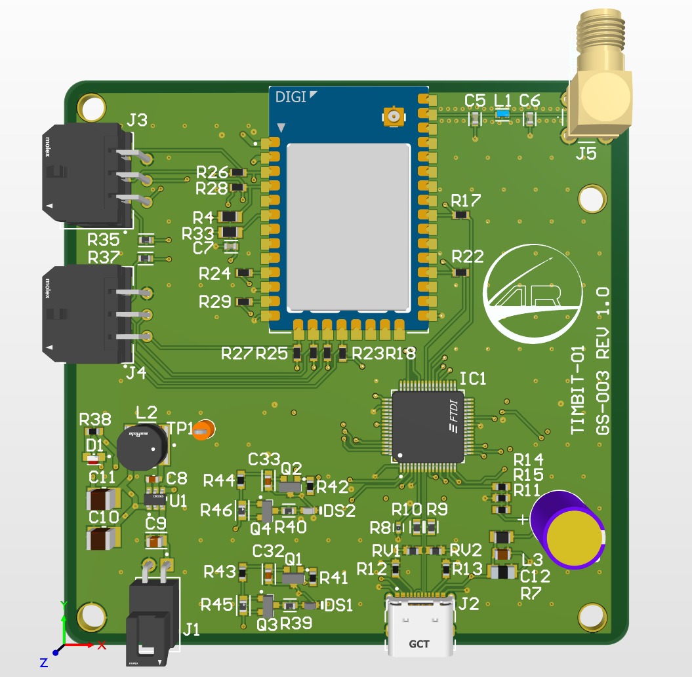
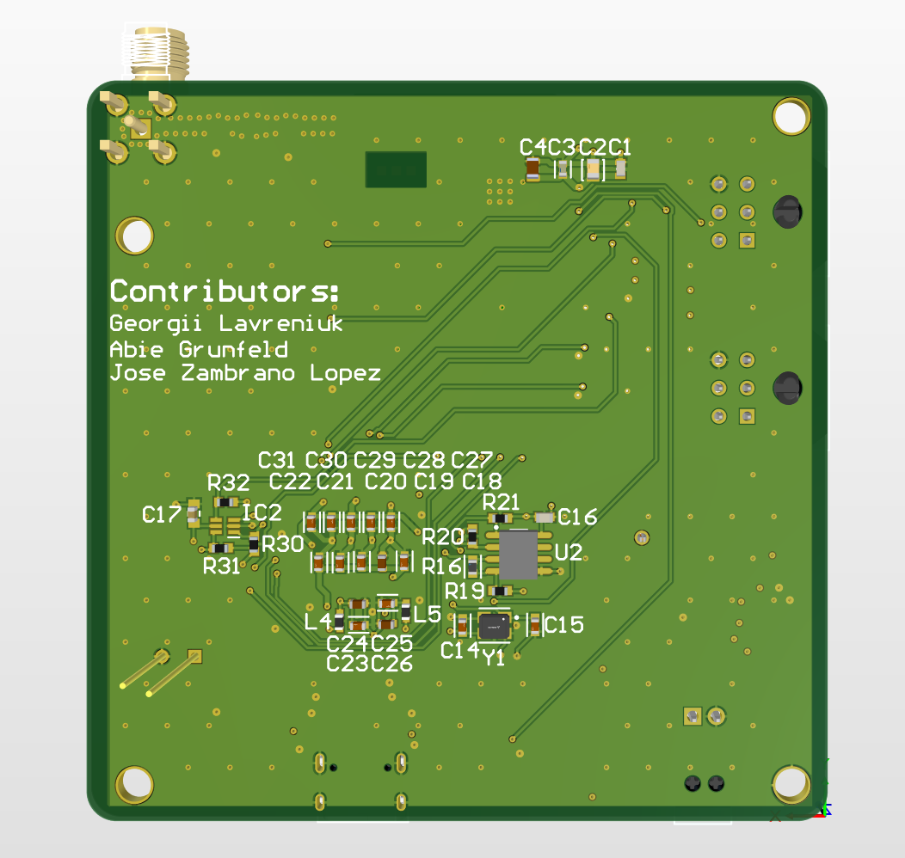
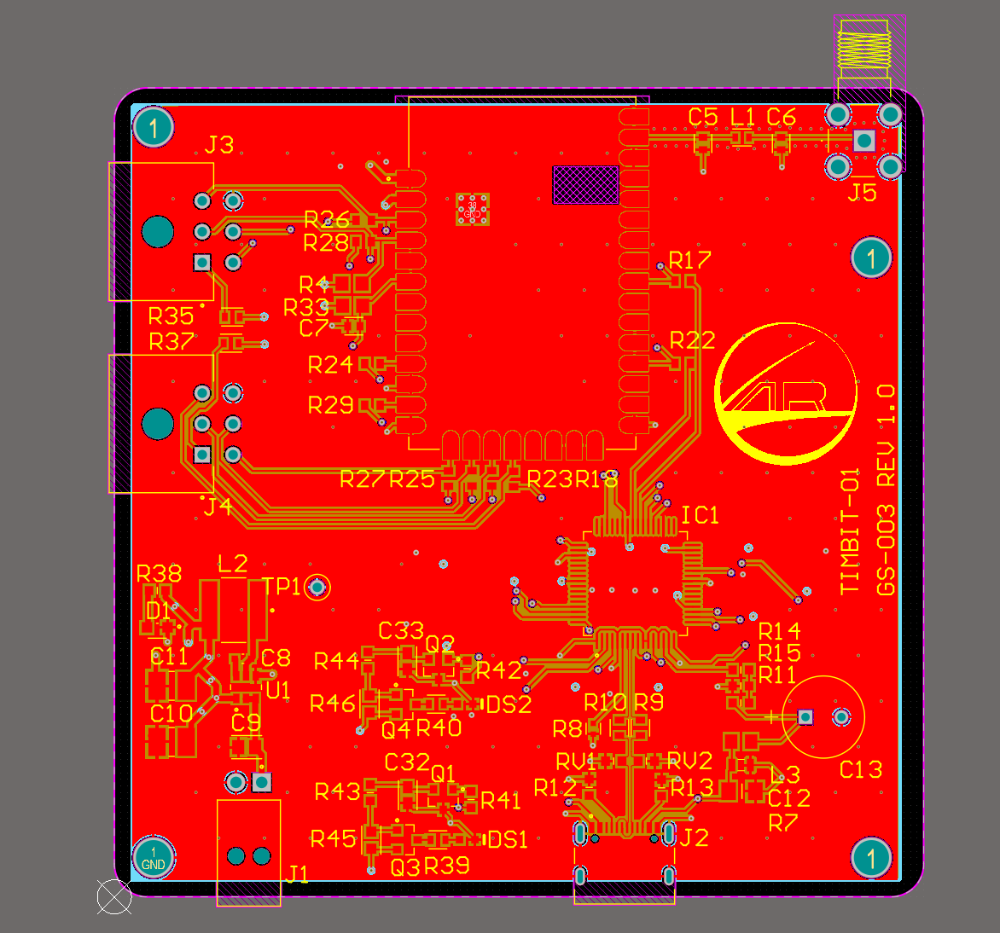
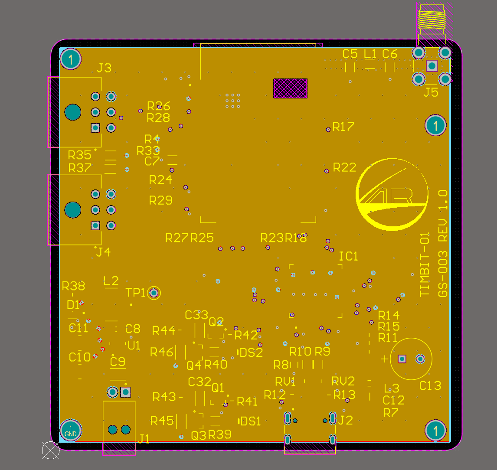
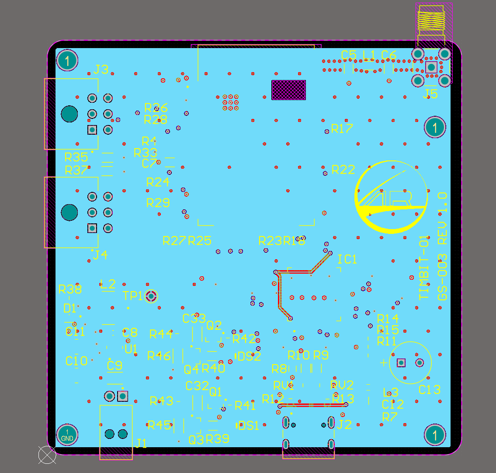
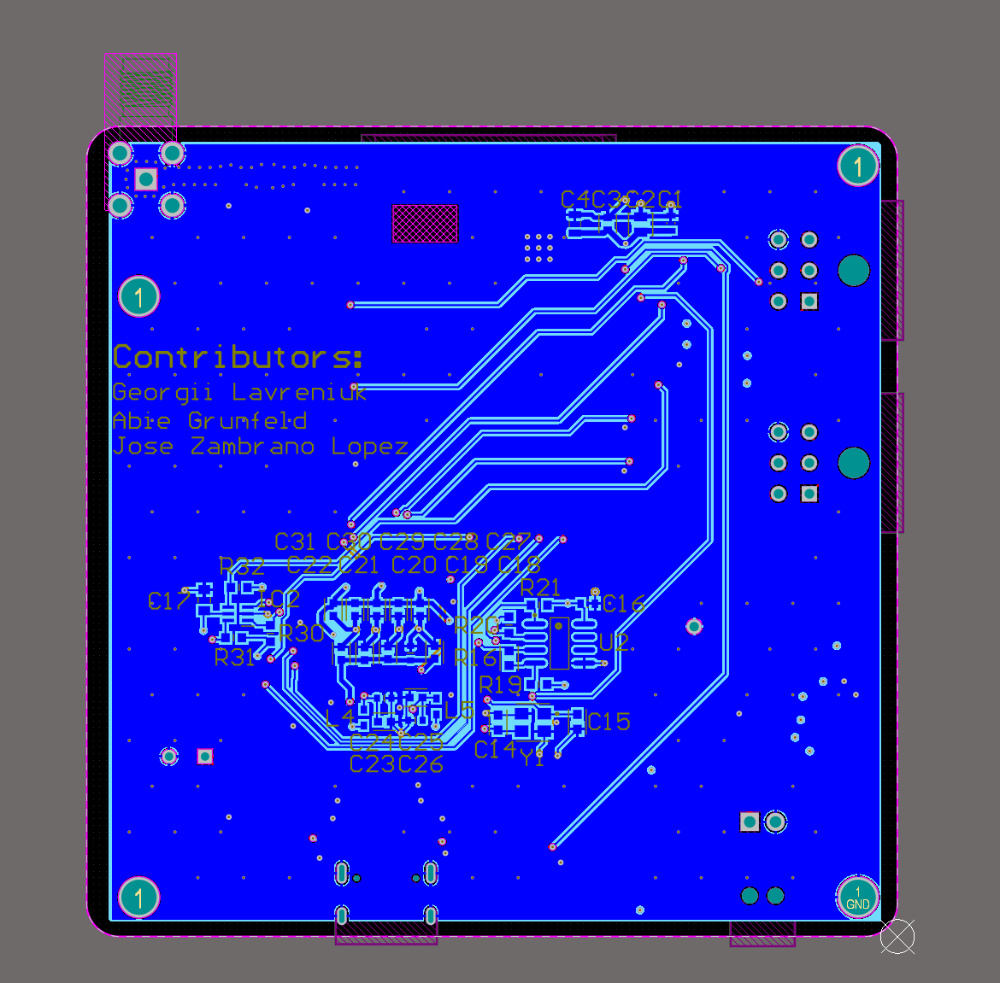

# TIMBIT-01 Transceiver

The TIMBIT-01 is a custom transciever PCB based around the XBee-PRO SX 900MHz RF module, designed for long-range communication between Arbalest Rocketry's 2026 GOOSE 5 rocket and ground station.

This project was designed in collaboration with Georgii Lavreniuk with guidance from the Ground Station Team lead Jose Zambrano Lopez.

---

## 3D Views

**Top View**

**Bottom View**

---

## Layer Views

**Layer 1**

**Layer 2**

**Layer 3**

**Layer 4**

---

## Project Files

* `XBeeSXPro_Breakout.PrjPcb` (project)
* Schematics: `XBeeRadioMain.SchDoc`, `FTDI_Chip.SchDoc`, `Peripherals.SchDoc`, `LED_Indicators.SchDoc`
* `MainPCB_XBeeSXPro_Breakout.PcbDoc` (layout)
* `XBeeBOM.BomDoc` (BOM)

---

